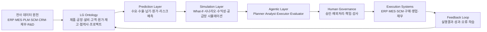
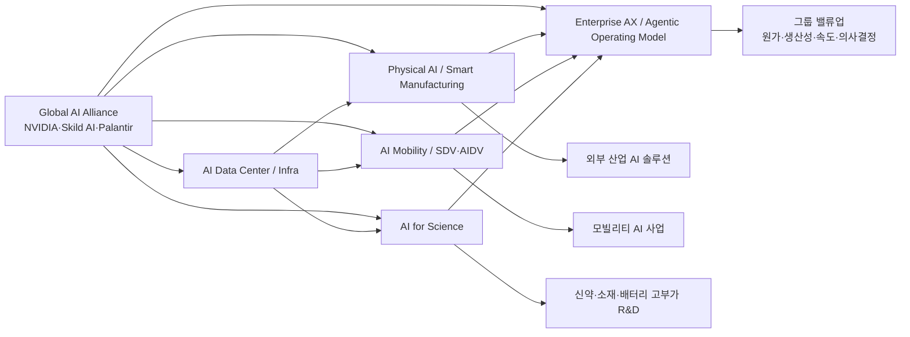

# LG그룹 AI 시대 사업기회 6대 테마 — 통합본

> 목적: 공개자료 기반으로 **LG그룹 관점**의 AI 시대 사업기회와 **각 LG 계열사별 역할**을 정리한다.   
> 작성일: 2026-06-20  
> 기준: 공개자료, 공식 발표, 주요 언론 보도 기반.  
> 활용: 테마별 위키 문서, 역할 매트릭스, 소스 인덱스, 슬라이드/HTML 보고서 생성의 입력 문서로 사용한다.

---

## 0. 작성 원칙

- 공개 보도, 공식 발표, 기술 리포트에서 반복적으로 확인되는 내용을 우선한다.
- 단일 발표에 과도하게 의존하지 않고, 공식자료·보도·기술자료를 교차 확인한다.
- 단순 업무 자동화가 아니라, 다음 중 하나에 해당하는 영역을 사업기회로 본다.
  - 외부 매출화 가능한 신사업
  - 그룹 전체 원가·생산성·수익성을 개선하는 밸류업 기회
  - AI 생태계에서 전략적 지위를 확보하는 기술·파트너십 기회

---

## 1. 요약: 6대 테마

| 번호 | 테마 | 한 줄 정의 | 주요 방향 | 계열사 |
|---:|---|---|---|---|
| 1 | AI Data Center / Infra | GPU, AI 데이터센터, 냉각, 전력, ESS, DC Grid, 클라우드 운영을 묶은 AI 인프라 사업 | AI가 돌아가는 데이터센터 기반 장악 | LG U+, LG CNS, LG전자, LG에너지솔루션, LG AI연구원 |
| 2 | Physical AI / Smart Manufacturing | 제조 데이터, 디지털트윈, 로봇, 공장 자동화를 AI로 통합 | 제조 현장을 AI 실행 공간으로 전환 | LG전자, LG CNS, LG AI연구원, LG에너지솔루션, LG디스플레이, LG화학, LG이노텍 |
| 3 | AI Mobility / SDV·AIDV | 차량을 AI 기반 소프트웨어·센서·디스플레이 플랫폼으로 전환 | 차량 내 AI 경험과 부품·SW 사업 확대 | LG전자 VS, LG이노텍, LG디스플레이, LG에너지솔루션, LG U+ |
| 4 | Enterprise AX / Agentic Operating Model | 전사 데이터·온톨로지·Agentic AI로 그룹 운영체계를 AI 중심으로 재설계 | 원가·생산성·의사결정 속도 중심의 밸류업 | LG Corp., LG AI연구원, LG CNS, 전 제조·사업 계열사 |
| 5 | AI for Science: Bio·Materials·Battery | 신약, 소재, 배터리, 화학 R&D를 AI Co-Scientist로 가속 | 고부가 R&D 영역에서 후보물질·소재 탐색 혁신 | LG AI연구원, LG화학, LG에너지솔루션, LG생활건강, LG CNS |
| 6 | Global AI Alliance / Open Innovation Network | NVIDIA, Skild AI, Palantir 등 글로벌 AI 핵심 기업과 초협력 체계 구축 | 독자 개발 한계를 넘는 기술 이식·생태계 포지셔닝 | LG Corp., LG Technology Ventures, LG AI연구원, LG CNS, LG전자, LG이노텍, LG에너지솔루션 |


---

## 2. 계열사별 전체 역할 맵

| 계열사 | 그룹 AI 전략 역할 | 관련 테마 |
|---|---|---|
| LG Corp. | 그룹 포트폴리오 조정, AI 전환 방향 설정, 글로벌 빅테크 협력 의제 설정 | 4, 6 |
| LG AI연구원 | EXAONE, K-EXAONE, EXAONE Discovery, Bio/Materials/Physical Intelligence, Advanced Agent 기반 기술 제공 | 1, 2, 4, 5, 6 |
| LG U+ | AIDC 운영, GPU 인프라, 통신망/네트워크 기반 AI 서비스, V2X/자율주행 통신 인프라 | 1, 3, 4 |
| LG CNS | 데이터센터 설계·구축·운영, DSX/AI 인프라 적용, 스마트팩토리·제조 AX, 엔터프라이즈 시스템 통합 | 1, 2, 4, 6 |
| LG전자 | AI 데이터센터 냉각/HVAC, 스마트팩토리 솔루션, 로봇, VS 기반 SDV·AIDV, AI Home/디바이스 | 1, 2, 3, 6 |
| LG에너지솔루션 | 800V DC 데이터센터 전력, UPS/ESS, 배터리 SW/BMTS, SDV 배터리 데이터, 배터리 소재 수요 | 1, 3, 5, 6 |
| LG디스플레이 | 차량용 OLED·P2P·Slidable 디스플레이, AI/SDV 시대 HMI, 디스플레이 제조 AI 적용 필드 | 2, 3, 5 |
| LG이노텍 | 차량용 카메라·LiDAR·Radar·통신·조명, NVIDIA DRIVE Hyperion 최적 부품, 로봇 부품 협력 가능성 | 2, 3, 6 |
| LG화학 | 첨단소재, 배터리 소재, 생명과학 R&D, AI 신약·소재 개발의 실험·검증 필드 | 2, 5, 6 |
| LG생활건강 | EXAONE Discovery 기반 화장품 효능 소재 개발·상용화 후보 | 5 |
| LG Technology Ventures | Skild AI 등 글로벌 AI/로봇 스타트업 지분투자, CVC 기반 기술 옵션 확보 | 6 |
| HSAD 등 | AI 시장·고객·브랜드 인사이트, 생성형 콘텐츠, 마케팅 AX | 4 |

---

## 3. 테마 x 계열사 역할 매트릭스

| 계열사 | 1 AI Data Center / Infra | 2 Physical AI | 3 Mobility | 4 Enterprise AX | 5 AI for Science | 6 Alliance |
|---|---|---|---|---|---|---|
| LG Corp. | 투자·협력 조정 | 그룹 방향 | 포트폴리오 조정 | 경영체질 개선/Palantir | 투자 방향 | 글로벌 제휴 주도 |
| LG AI연구원 | EXAONE 워크로드 | 모델/Agent | 멀티모달 Agent | 공통 AI 모델 | EXAONE Discovery | NVIDIA/D&D 협력 |
| LG U+ | AIDC/GPU/운영 | 연결성 | V2X/5G | 통신 운영 데이터 | - | Rubin GPU/AIDC |
| LG CNS | DSX/DC 구축 | 스마트팩토리/로봇 | 데이터 플랫폼 | 시스템 통합 | R&D 데이터 플랫폼 | Skild/DSX |
| LG전자 | 냉각/HVAC | 스마트팩토리/로봇 | IVI/ADAS/AI Cockpit | 제조·판매 데이터 | 일부 소재 수요 | NVIDIA 협력 |
| LG에너지솔루션 | 800V DC/ESS/UPS | 배터리 제조 AI | BMS/BMTS/SDVerse | 원가·수요·공장 최적화 | 배터리 소재 | NVIDIA/Qualcomm |
| LG디스플레이 | 내부 수요 | 제조 AI | 차량용 OLED/HMI | 수율·CAPEX 최적화 | OLED 소재 | OEM 생태계 |
| LG이노텍 | 내부 수요 | 부품/로봇 센서 | 카메라/LiDAR/Radar/V2X | 부품 수요·품질 | 광학/기판 소재 | NVIDIA/Skild |
| LG화학 | 내부 수요 | 화학 공정 AI | 소재 일부 | 원자재·R&D 포트폴리오 | 신약/소재 | Open Innovation |
| LG생활건강 | - | - | - | 수요/브랜드 AX | 화장품 원료 | 뷰티테크 |
| LG Technology Ventures | - | 투자 옵션 | 투자 옵션 | 투자 옵션 | 투자 옵션 | CVC 핵심 |

---

# 1. AI Data Center / Infra

## 정의

AI Data Center / Infra는 AI 시대에 필요한 **GPU 컴퓨팅, AI 데이터센터, 냉각, 전력, ESS, DC Grid, 네트워크, 클라우드 운영 소프트웨어**를 그룹 차원에서 묶는 사업기회다. 기존 데이터센터가 범용 서버 공간과 네트워크를 제공하는 인프라 사업에 가까웠다면, AI 데이터센터는 고밀도 GPU 랙, 대규모 전력, 고효율 냉각, 안정적 운영, 워크로드 최적화가 결합된 **AI 연산 기반 시설**이다.

공개자료를 종합하면 LG그룹의 AI Data Center / Infra 기회는 다음 네 축으로 분해된다.

1. **AIDC 운영자**: LG U+의 파주 AIDC, 고밀도 랙·전력·냉각 운영 역량
2. **데이터센터 설계·구축자**: LG CNS의 설계·구축·운영·마이그레이션 역량과 AI Box/해외 AIDC
3. **냉각·열관리 제공자**: LG전자의 DTC, CDU, CRAH, Chiller, DCCM, immersion cooling
4. **전력·배터리 인프라 제공자**: LG에너지솔루션의 ESS/UPS 배터리, DC Grid 연계

## 공개자료 기반 근거: 다중 소스 정리

### 1.1 LG U+ — Paju AIDC와 AI Data Center Operator 전략

LG U+는 파주 AI 데이터센터를 중심으로 2030년까지 AIDC 누적 수주 5조 원을 목표로 제시했다. 보도에 따르면 파주 AIDC는 약 150,000㎡ 규모, 200MW급 전력, 공랭·액체냉각을 동시에 지원하는 하이브리드 구조, 모듈러 방식의 공기 단축, 99.999% 수준의 운영 안정성을 핵심으로 한다. 특히 LG U+는 단순 임대 사업자를 넘어 GPU·전력·냉각·운영 요소를 통합 관리하는 **AI Data Center Operator / AI Infra Operator**로 진화할 수 있다.

또한 해당 보도들은 One LG 생태계 관점에서 LG전자 냉각, LG에너지솔루션 배터리·전력, LS 계열 전력 솔루션이 함께 들어가는 구조를 설명한다. 이 점은 AIDC가 단일 통신사 사업이 아니라 그룹형 인프라 패키지 사업으로 확장될 수 있음을 보여준다.

### 1.2 LG전자 — AI 데이터센터 냉각·운영 최적화 솔루션

LG전자는 Data Center World 2026에서 AI 데이터센터용 통합 냉각 포트폴리오를 공개했다. 공개자료 기준 주요 구성은 Direct-to-Chip(DTC) 냉각, 1.4MW CDU, CRAH, 공랭식 원심 칠러, immersion cooling, Data Center Cooling Management(DCCM), AI 기반 workload orchestration, DC Grid 솔루션이다.

특히 DCCM은 CDU·CRAH·ACC 등 복잡한 냉각 인프라를 통합 모니터링하고, 이상 탐지·가상 센서 기반 진단·예지보전·IT 워크로드 기반 실시간 최적화를 수행하는 방향으로 설명된다. 이는 LG전자가 단순 장비 공급자가 아니라 **냉각 하드웨어 + 운영 소프트웨어 + 에너지 최적화**를 결합한 AIDC 솔루션 사업자로 이동하고 있음을 시사한다.

### 1.3 LG CNS — 데이터센터 라이프사이클 사업자

LG CNS는 데이터센터 사업을 컨설팅, 설계, 구축, 운영, 마이그레이션, 판매까지 포괄하는 전체 라이프사이클 사업으로 설명한다. 또한 인도네시아 자카르타 AI 데이터센터 구축, 소형 모듈러 데이터센터인 AI Box, 대규모 캠퍼스형 AI Box 확장 등으로 AIDC 시장에 대응하고 있다.

LG CNS의 역할은 직접 AIDC를 소유·운영하는 것에 국한되지 않는다. 고객의 AI 인프라를 빠르게 구축하고, 운영 플랫폼·클라우드·보안·마이그레이션을 결합해 **기업용 AI 인프라 구축 파트너**로 포지셔닝할 수 있다.

### 1.4 LG에너지솔루션 — ESS·UPS·DC Grid 기반 전력 안정화

AI 데이터센터는 전력 품질, 순간 부하 변동, 정전 대응, 냉각 전력 효율이 사업 경쟁력의 핵심이 된다. LG에너지솔루션은 글로벌 ESS 생산능력 확대와 대형 ESS 수주를 추진하고 있으며, 파주 AIDC 등 One LG 구조에서는 UPS 배터리·ESS·DC 800V 전력 체계와 연결될 수 있다.

LG전자 DCW 2026 자료에서도 LG에너지솔루션이 참여하는 DC Grid 솔루션이 언급된다. DC Grid는 기존 AC 방식의 전력 변환 단계를 줄여 에너지 손실을 낮추는 방향이며, AI 데이터센터의 전력 효율·총운영비 절감과 직접 연결된다.

### 1.5 NVIDIA 협력 — 가속 컴퓨팅과 데이터센터 레퍼런스 축

NVIDIA와의 협력은 이 테마의 중요한 촉매이지만, 전체 기회의 전부는 아니다. 1번 테마에서 NVIDIA 협력은 GPU 컴퓨팅, AI 워크로드, 고밀도 랙, 데이터센터 레퍼런스 아키텍처를 가속하는 축으로 이해하는 것이 적절하다. 반면 로봇·자율주행·디지털트윈 시뮬레이션을 하나의 workflow로 묶는 **AI Factory 운영 모델**은 2번 Physical AI / Smart Manufacturing의 하위 개념으로 정리한다.

## 계열사별 역할

| 계열사 | 구체 역할 | 확인 수준 | 근거/메모 |
|---|---|---|---|
| LG U+ | 대규모 AIDC 사업자 및 AI Data Center Operator. 파주 AIDC, 고밀도 GPU 랙 수용, 서버·전력·냉각·운영 인프라 관리 | 확인됨 | 2030년 AIDC 누적 수주 5조 원 목표, 200MW급 파주 AIDC, Rubin GPU 기반 AI Infra 계획 보도 |
| LG CNS | 데이터센터 컨설팅·설계·구축·운영 전 생애주기 제공. DSX 등 AI 데이터센터 레퍼런스 아키텍처 적용. AI Box/모듈형 DC 및 차세대 AIDC 구축 | 확인됨 | LG CNS는 DC lifecycle provider 및 기업용 AI 인프라 구축 파트너로 해석 가능 |
| LG전자 | 데이터센터 냉각·열관리. CDU, Cold Plate, D2C 냉각, 고효율 칠러, BECON 제어, 모듈러 냉각 설계 | 확인됨 | Data Center World 2026 및 NVIDIA M.A.P. 발표에서 냉각 솔루션 역할 명시 |
| LG에너지솔루션 | 800V DC 기반 데이터센터 전력 솔루션, UPS/BESS/ESS, AI 워크로드의 전력 안정화 | 확인됨 | NVIDIA와 800V DC 데이터센터 전력 솔루션 협력 명시, 데이터센터용 UPS/ESS 역할 언급 |
| LG AI연구원 | EXAONE/K-EXAONE 학습·추론 워크로드의 핵심 수요자. 대규모 GPU·AIDC 수요와 모델 학습·평가·최적화 유스케이스 제공 | 확인됨 | NVIDIA Blackwell GPU, NeMo, Nemotron, TensorRT-LLM 활용 통한 EXAONE 효율화 계획 명시 |
| LG Corp. | NVIDIA와의 그룹 차원 협력 조율, 계열사 간 AI 데이터센터 투자·사업 포트폴리오 조정 | 확인됨 | LG-NVIDIA M.A.P. 및 회장단 협력 발표 기반 |
| LG디스플레이 / LG이노텍 / LG화학 | AI 데이터센터의 내부 수요자. 제조·소재·부품 R&D 시뮬레이션, 품질·공정 AI 학습 수요 제공 | 연계 가능 | 개별 발표보다는 제조·R&D 데이터 수요 기반의 연계 역할 |

## 사업기회

- AI 데이터센터 설계·구축·운영
- GPU 클라우드 및 산업용 AI 컴퓨팅 서비스
- 고밀도 랙·수랭·액침냉각 패키지
- 냉각 장비 + DCCM 소프트웨어 + workload orchestration 통합 사업
- ESS, UPS, DC Grid 기반 전력 안정화 패키지
- 데이터센터 운영 최적화 AI
- 기업용 Private AI 인프라 패키지
- 제조·모빌리티·바이오용 대규모 AI 학습·추론 인프라

## 그룹 관점 의미

AI 시대의 병목은 모델 성능만이 아니라 **전력, 냉각, GPU 확보, 안정 운영, 총소유비용(TCO)**이다. LG그룹은 통신·데이터센터 운영, IT 구축, 냉각, 전력·배터리, 산업 데이터라는 자산을 동시에 보유하고 있어 AI Data Center / Infra를 단일 사업이 아니라 **One LG형 인프라 패키지**로 확장할 수 있다.

## 리스크 및 추가 조사 과제

- AIDC 전력 확보와 계통 접속 리스크
- 냉각 방식별 경제성: 공랭, 수랭, 액침, 하이브리드
- GPU 공급·가격 변동에 따른 사업성 민감도
- 글로벌 클라우드 사업자와 국내 통신·SI 사업자의 경쟁 구도
- ESS/UPS 안전성, 화재 리스크, 보험·규제 이슈
- 기존 데이터센터 대비 AIDC의 차별화 KPI 정의: GPU utilization, PUE, compute/MW, rack density, inference latency, 전력 안정성

---

# 2. Physical AI / Smart Manufacturing

## 정의

Physical AI / Smart Manufacturing은 AI가 문서·이미지·코드 공간을 넘어 **공장, 설비, 로봇, 물류, 품질, 안전** 등 물리 세계에서 판단하고 실행하는 영역이다. LG그룹 관점에서는 스마트팩토리, 제조 데이터, 디지털트윈, 로봇, 예지보전, 생산·품질 최적화가 하나의 실행 체계로 연결된다.

이 테마도 NVIDIA 협력만으로 설명하면 좁아진다. 공개자료를 종합하면 LG그룹의 Physical AI 기회는 다음 네 축으로 정리된다.

1. **LG전자 Smart Factory Solutions**: 실제 제조 경험 기반의 솔루션 외부 사업화
2. **LG Smart Park 레퍼런스**: WEF Lighthouse Factory, 디지털트윈·AI·로봇·5G 물류 자동화
3. **LG CNS Factova**: AI·빅데이터·IoT 기반 제조 AX 플랫폼의 북미·글로벌 확장
4. **로봇·RFM·산업 데이터 결합**: 노동집약·비정형 공정의 자동화 고도화

## 공개자료 기반 근거: 다중 소스 정리

### 2.1 LG전자 — 제조 경험 기반 Smart Factory Solutions 외부 사업화

LG전자는 2026년 공개자료에서 스마트팩토리 사업을 2030년 billion-dollar global business로 성장시키겠다는 방향을 제시했다. 핵심 차별점은 “제조사가 만든 제조 솔루션”이라는 점이다. LG전자는 글로벌 생산 현장에서 축적한 제조 데이터와 자동화 경험을 기반으로, 반도체·자동차·중공업·제약 등 고성장 산업으로 솔루션을 확장하겠다고 설명한다.

특히 LG전자는 Physical AI의 차별성을 “실제 제조 환경에 기반한 데이터와 생산 자동화 경험”에서 찾는다. 대규모 제조 데이터를 기반으로 사람·로봇·설비가 정보를 공유하고 협업하는 intelligent operating system을 통해, 공장이 스스로 사고하고 행동하는 방향으로 진화한다는 비전이 제시됐다.

### 2.2 LG Smart Park — WEF Lighthouse Factory 레퍼런스

LG Smart Park는 2022년 WEF Lighthouse Factory로 선정되었다. 공식자료에 따르면 Changwon 공장은 디지털 트윈, edge computing, 머신러닝 기반 결함 예측, 3차원 물류 자동화, 5G 기반 AGV, AI 엔진·카메라를 탑재한 로봇 등을 적용했다.

정량 성과도 의미가 있다. 공식자료는 결함 제품 반품 비용이 2020년에서 2021년 사이 70% 감소했고, 물류 자동화를 통해 창고 공간을 30% 줄이고 시간당 부품 운송 시간을 25% 단축했다고 설명한다. 이 레퍼런스는 LG가 Physical AI를 단순 기술 데모가 아니라 실제 공장 생산성·품질·물류 개선 사례로 설명할 수 있는 기반이다.

### 2.3 LG CNS Factova — 제조 AX 플랫폼의 외부화

LG CNS는 북미 제조 AX 시장을 겨냥해 Factova를 공개·확장하고 있다. 보도에 따르면 Factova는 AI, 빅데이터, IoT 기술을 제조 운영 전반에 적용해 생산 효율을 최적화하는 스마트팩토리 브랜드이며, 20년 이상의 제조 운영 경험과 LG 계열사·해외 제조 현장 프로젝트 경험을 기반으로 한다.

Factova MES는 제조 데이터를 실시간 분석해 공정 비효율을 줄이고 생산 운영을 최적화한다. Factova Control은 여러 제조사의 생산 장비 데이터를 통합 관리하고 AI 기반 이상탐지와 예지보전을 지원한다. 보도에서는 100,000개 이상의 제조 장비 적용, 배터리 공장의 한 달 내 90% 이상 양품률 달성, 전자 공장의 생산성 약 20% 개선, 공정 데이터 90% 이상 자동 수집 사례가 언급됐다.

### 2.4 로봇·RFM·비정형 공정 자동화

LG그룹의 Physical AI는 기존 산업로봇이 잘 수행하던 반복·정형 작업을 넘어, 사람의 판단과 적응이 필요했던 비정형 공정으로 확장될 수 있다. LG 공식자료는 Skild AI의 Robotic Foundation Model(RFM)을 제조·물류 산업 데이터로 최적화해 기존 로봇이 수행하기 어려웠던 작업을 지원하는 산업 AI 휴머노이드 솔루션 개발 방향을 언급했다.

다만 로봇 파운데이션 모델은 아직 산업 적용 성숙도를 검증해야 하는 영역이다. 따라서 이 항목은 단기 사업기회라기보다 중장기 옵션으로 분류한다.

### 2.5 AI Factory 

AI Factory는 제조·로봇·디지털트윈·합성데이터·시뮬레이션을 하나의 workflow로 연결하는 실행 체계다.

```text
AI Data Center / Infra
  → GPU·전력·냉각·클라우드 운영 기반 제공
Physical AI / Smart Manufacturing
  → AI Factory 운영 모델을 활용해 제조·로봇·디지털트윈 실행
Global AI Alliance
  → NVIDIA, Skild AI 등 외부 기술을 통해 AI Factory 구성요소 확보
```

## 계열사별 역할

| 계열사 | 구체 역할 | 확인 수준 | 근거/메모 |
|---|---|---|---|
| LG전자 | 제조 현장 경험 기반 스마트팩토리 솔루션, 생산기술, 로봇, 공장 디지털트윈, Physical AI 적용. 고객 제조사 대상 end-to-end 스마트팩토리 사업화 | 확인됨 | LG전자 공식 인터뷰에서 미래 공장은 Physical AI와 Manufacturing Intelligence로 스스로 사고·행동한다고 설명 |
| LG CNS | 스마트팩토리 플랫폼/시스템 통합, 제조 AX, 산업용 휴머노이드 솔루션, Skild AI RFM 기반 산업 현장 로봇 솔루션 개발 | 확인됨 | Skild AI와 산업용 AI 휴머노이드 솔루션 개발, 제조·물류 데이터 최적화 계획 언급 |
| LG AI연구원 | Physical Intelligence, Advanced Agent, EXAONE 기반 제조 문서·공정·시각 데이터 이해, 로봇/공정 모델 개발 | 확인됨/연계 가능 | 공식 연구영역에 Physical Intelligence, Advanced Agent 포함. NVIDIA 협력에서 EXAONE 생태계 고도화 언급 |
| LG에너지솔루션 | 배터리 제조공정, 품질검사, 생산 최적화, 스마트팩토리 레퍼런스 필드. 배터리 제조 데이터 기반 AI 적용 | 연계 가능 | 배터리 제조공정은 고난도 제조 AI 적용 필드이나, 테마 직접 발표는 추가 확인 필요 |
| LG디스플레이 | OLED/차량용 디스플레이 제조공정, 수율·검사·공정 최적화, 디지털트윈 적용 필드 | 연계 가능 | 제조 난도 높은 공정 보유. 직접 Physical AI 발표는 제한적 |
| LG화학 | 화학·첨단소재 생산공정 최적화, 에너지·품질·안전 AI 적용 필드 | 연계 가능 | 화학 공정 데이터와 소재 R&D 역량 기반 |
| LG이노텍 | 부품 제조 품질검사, 카메라·센서 제조공정, 로봇/자율주행용 부품 공급 가능성 | 확인됨/연계 가능 | Skild AI와 부품 공급 협력 기회 탐색 언급 |
| LG U+ | 제조 현장의 private 5G, edge network, 로봇/AMR 연결성, 원격관제 인프라 | 연계 가능 | 통신 인프라 역량 기반. 개별 테마 직접 발표는 후속 확인 필요 |

## 사업기회

- 스마트팩토리 AI 플랫폼
- 공정 최적화 및 품질 예측 AI
- 설비 이상탐지·예지보전
- 제조 디지털트윈
- 제조 데이터 온톨로지 및 지식 그래프
- 로봇 시뮬레이션·훈련·검증
- 물류·창고·공장 내 AMR 및 휴머노이드 적용
- 제조 안전 Agent
- 제조 AX 컨설팅 및 솔루션 외부 사업화

## 그룹 관점 의미

LG그룹은 전자, 배터리, 디스플레이, 화학, 소재 등 제조 난도가 높은 현장을 보유하고 있다. 이 제조 현장은 단순한 내부 효율화 대상이 아니라, **산업 AI 솔루션을 검증하고 외부화할 수 있는 레퍼런스 필드**다. 특히 제조 AX는 그룹 내부에서 먼저 검증하고, 이후 글로벌 제조 고객에게 수출할 수 있는 구조가 가능하다.

## 리스크 및 추가 조사 과제

- Physical AI와 기존 스마트팩토리의 실질 차별화 정의
- 제조 데이터 표준화·온톨로지 구축 필요성
- 산업용 휴머노이드가 실제 투입 가능한 공정 유형
- 디지털트윈 ROI 측정 방식
- 현장 안전·품질 책임 소재와 AI 의사결정 거버넌스
- 글로벌 제조 솔루션 시장에서 Siemens, Rockwell, Schneider, PTC, SAP, AWS, Microsoft와의 경쟁 구도

---

# 3. AI Mobility / SDV·AIDV

## 정의

AI Mobility는 차량이 단순 이동 수단에서 **소프트웨어 정의 차량(SDV), AI 정의 차량(AIDV), 탑승자 경험 플랫폼**으로 전환되는 흐름이다. LG그룹은 차량용 디스플레이, 센싱, 전장, 배터리, BMS, 인포테인먼트, 통신 모듈 등 다양한 접점을 보유하고 있다.

## 공개자료 기반 근거

- LG와 NVIDIA의 M.A.P. 협력에서 Mobility는 AI Data Center / Infra, Physical AI와 함께 핵심 축으로 제시됐다.
- NVIDIA 협력 발표는 자율주행, 로봇, 데이터센터 기술, GPU 클라우드 서비스가 AI 인프라와 Physical AI 운영 모델을 기반으로 함께 고도화된다고 설명한다.
- LG그룹의 차량 관련 계열사들은 SDV 전환에 맞춘 차량용 디스플레이, 센싱 모듈, 배터리 진단·관리 SW, 인포테인먼트 기술을 각각 확대하고 있다.

## 계열사별 역할

| 계열사 | 구체 역할 | 확인 수준 | 근거/메모 |
|---|---|---|---|
| LG전자 VS | IVI, ADAS, in-vehicle AI, AI Cockpit, edge AI processing, NVIDIA DRIVE Hyperion/DRIVE AGX 연계 | 확인됨 | NVIDIA M.A.P. 발표에서 IVI 역량과 DRIVE Hyperion 결합, ADAS·SDV 로드맵 지원 명시 |
| LG이노텍 | 차량용 카메라, LiDAR, Radar, V2X/통신 모듈, 조명, 자율주행 융합 센싱. NVIDIA DRIVE Hyperion 최적 부품 개발 | 확인됨 | CES 2026 AIDV 솔루션, 35개 핵심 부품, sensing/connectivity/lighting 및 Hyperion 최적화 발표 |
| LG디스플레이 | 차량용 OLED, Pillar-to-Pillar, Slidable OLED, 투명·스트레처블 디스플레이. SDV 시대 AI UX/HMI 화면 인프라 | 확인됨 | CES 2026에서 SDV 환경에 최적화된 차량용 디스플레이 솔루션 공개 |
| LG에너지솔루션 | BMS/BMTS, B.around, 배터리 안전진단, 수명예측, SDVerse 기반 배터리 SW 판매, SDV 배터리 데이터 서비스 | 확인됨 | SDVerse 첫 배터리 기업 참여, 5개 배터리 SW 솔루션, B.around의 AI·클라우드 기반 배터리 관리 |
| LG U+ | V2X, 5G 기반 자율주행 통신, 정밀측위, HD Map 연계, connected mobility 통신 인프라 | 확인됨/연계 가능 | LG U+ 자율주행 5G·정밀측위 통합 통신 솔루션 공개자료 기반 |
| LG AI연구원 | 멀티모달/문서/시각 모델, 차량 내 Agent, 주행·정비·배터리 데이터 해석 모델, SDV Agent 기반 기술 | 연계 가능 | 직접 SDV 발표보다는 EXAONE/멀티모달/Advanced Agent 역량 기반 |
| LG CNS | SDV 소프트웨어 개발 체계, 차량 데이터 플랫폼, 클라우드/보안/OTA 운영 체계 | 검증 필요 | 그룹 내 IT/SW 통합 역량 기반. 직접 SDV 사례 추가 조사 필요 |
| LG Corp. | 모빌리티 포트폴리오 조정 및 NVIDIA 등 글로벌 파트너십 연결 | 확인됨 | M.A.P. 협력에서 Mobility가 3대 축으로 제시됨 |

## 사업기회 구조

```text
차량 외부 인지     : LG이노텍 센서/카메라/LiDAR/Radar
차량 내부 경험     : LG전자 IVI/AI Cockpit + LG디스플레이 HMI
차량 에너지/안전   : LG에너지솔루션 BMS/BMTS/SW
차량 연결성        : LG U+ V2X/5G/정밀측위
AI 모델·Agent      : LG AI연구원 멀티모달/Agent 기술
OEM 패키지화       : LG전자 VS 중심 통합 제안
```

## 사업기회

- SDV/AIDV용 AI Cabin Platform
- 차량용 온디바이스 AI
- ADAS·자율주행 센싱 솔루션
- 차량용 디스플레이·HMI 플랫폼
- 배터리 진단, 수명예측, BMS 소프트웨어
- 전기차 충전·에너지 관리 연계 서비스
- 차량 데이터 기반 구독형 서비스

## 그룹 관점 의미

AI Mobility는 단일 부품 공급 경쟁에서 벗어나 **차량 내 AI 경험과 운영 소프트웨어**를 장악하는 방향이다. 차량 내부는 향후 집, 사무실, 매장에 이은 또 하나의 AI 실행 공간이 될 수 있다.

## 추가 조사 과제

- SDV, AIDV, 자율주행, 차량용 AI Agent 개념 차이
- 차량용 AI 반도체·센서·디스플레이 밸류체인
- BMS 소프트웨어와 배터리 데이터 사업모델
- 차량 내 AI Companion / AI Concierge 사례
- 완성차 OEM과 Tier 1·Tier 2의 수익배분 구조 변화

---

# 4. Enterprise AX / Agentic Operating Model

## 정의

Enterprise AX / Agentic Operating Model은 LG그룹의 경영·운영 방식을 **AI 중심의 전사 운영체계**로 재설계하는 테마다. 목적은 개별 직원의 업무 자동화가 아니라, 제품·고객·공장·공급망·재무·R&D·구매·물류 데이터를 하나의 의미 체계로 연결하고, AI Agent가 예측·시뮬레이션·제안·실행·평가를 반복하면서 그룹 전체의 원가, 생산성, 의사결정 속도를 개선하는 것이다.

즉, 이 테마는 다음 전환을 의미한다.

```text
기존: 부서별 데이터 → 사람이 취합 → 보고서 작성 → 회의 → 의사결정 → 실행 → 사후 분석
전환: 전사 데이터/온톨로지 → AI 예측·시뮬레이션 → Agent 제안 → 인간 승인/조정 → 실행 자동화 → 결과 학습
```

## 핵심 문제의식

- 거시경제 불확실성, 수요 변동성, 환율·원자재·물류비 변동이 커질수록 월간·분기 중심 경영관리 체계는 느리다.
- R&D, 구매, 생산, 재고, 물류, 판매, 재무 데이터가 분산되어 있으면 AI는 전사 최적화를 수행하지 못하고 부서별 부분 최적화에 머문다.
- 생성형 AI를 개인 생산성 도구로만 배포하면 구조적 원가 경쟁력, 납기, 재고, 현금흐름 개선으로 이어지기 어렵다.
- 따라서 그룹 AX는 “업무도구 도입”이 아니라 **데이터 기반 경영 체질 개선**이어야 한다.

## 공개자료 기반 근거

### 4.1 그룹 최고경영진의 방향: AI 상용화와 실행력 강화

LG Corp. 공식 발표에 따르면 구광모 회장은 2026년 4월 Silicon Valley에서 Palantir CEO Alex Karp 및 Skild AI 창업진과 만나 LG의 AI 상용화 방향과 실행을 가속하기 위한 논의를 진행했다. 특히 Palantir와는 Ontology, 즉 AI·데이터 기반 의사결정 프레임워크와 대표 혁신 사례를 논의했다. 이 발표는 LG의 AX가 단순 생성형 AI 도입을 넘어 **기업 데이터를 통합하고 빠른 의사결정을 가능하게 하는 운영체계**로 향하고 있음을 보여준다.

### 4.2 Palantir식 온톨로지: 데이터 통합이 아니라 의사결정 객체화

Palantir와 LG CNS의 전략적 파트너십 발표는 “성공적인 LG 계열사 적용 사례를 기반으로 LG그룹 전반의 AX를 추진한다”는 방향을 명시했다. 여기서 중요한 것은 특정 솔루션 벤더명이 아니라 **온톨로지 기반 운영 방식**이다. 온톨로지는 단순 데이터 레이크나 RAG 인덱스가 아니라 제품, 공장, 설비, 주문, 재고, 협력사, 원가, 고객, 프로젝트 등 비즈니스 객체와 관계를 정의해 AI가 의사결정 가능한 구조로 만드는 방식이다.

그룹 관점에서 이는 `전사 데이터 통합 → 비즈니스 객체 모델링 → 시뮬레이션 → Agent 실행 → 결과 피드백`의 기반이 된다.

### 4.3 LG전자 AX 방향: End-to-End AI 운영과 속도·생산성·실행력

LG전자는 2026년 전략 방향 발표에서 AX를 통해 end-to-end AI-driven operations를 강화하고, 회사 전반의 속도, 생산성, 실행력을 개선하겠다고 밝혔다. 이는 AX가 프론트 업무 생산성뿐 아니라 기획, 개발, 구매, 제조, 공급망, 판매, 서비스까지 연결되는 운영 체계 변화임을 시사한다.

### 4.4 LG디스플레이 사례: AI가 설계·수율·품질·사무 영역을 동시에 개선

LG디스플레이는 2025년 AI를 전체 업무 프로세스에 적용해 3년 내 생산성을 30% 개선하겠다는 계획을 발표했다. 보도에 따르면 AI 기반 제조 프로세스로 생산성 개선, AI 설계 시스템을 통한 설계 시간 단축, OLED 결함 원인 분석, 품질 개선 리드타임 단축, Hi-D AI assistant 기반 사무 생산성 향상이 함께 언급됐다.

이 사례는 4번 테마가 단순 업무 자동화가 아니라 **설계-제조-품질-사무**를 하나의 AX 체계로 연결해야 한다는 점을 보여준다.

### 4.5 LG에너지솔루션 사례: 비용 절감·제품 경쟁력·제조 운영을 AI로 연결

LG에너지솔루션 CEO는 2026년 신년 메시지에서 AI 전환이 생존과 직결된 핵심 과제라고 언급했고, 제품 개발, 소재 개발, 제조 운영의 세 영역에 AI를 적용해 2030년까지 생산성을 최소 30% 개선하겠다고 밝혔다. 이 방향은 배터리 산업의 수요 변동, 원가 압박, ESS 전환, 글로벌 공급망 리스크 속에서 AI가 비용 구조와 운영 효율을 개선하는 핵심 수단으로 인식되고 있음을 보여준다.

### 4.6 LG화학 사례: One-Agent-Per-Employee에서 업무 운영 재설계로

LG화학은 사무직 절반 이상이 AI 활용 교육을 완료했고, “one-agent-per-employee” 모델을 중심으로 문서 작성, 데이터 분석, 보고서 생성, 구매, 일정, 사내 정책 안내, 기술·특허 정보 분석 등 업무 자동화를 확대하고 있다. 이는 개인 업무 자동화에서 시작하지만, 향후 팀 단위 workflow analysis와 문제 해결 캠프를 통해 업무 프로세스 자체를 재설계하는 방향으로 확장될 수 있다.

## 목표 상태: LG형 AI Operating Model

### 4.7 핵심 구조



### 4.8 5개 핵심 레이어

| 레이어 | 설명 | 핵심 질문 |
|---|---|---|
| Data Foundation | ERP, MES, PLM, SCM, CRM, 재무, R&D, 고객 데이터를 연결 | 어떤 데이터가 어디에 있고, 신뢰 가능한가? |
| Ontology / Knowledge Graph | 제품·공장·설비·고객·원가·협력사 등 비즈니스 객체와 관계 정의 | AI가 의미와 관계를 이해할 수 있는가? |
| Prediction & Simulation | 수요, 재고, 원가, 수율, 납기, 환율, 공급망 리스크 예측 | 어떤 일이 일어날 것이며, 대안별 결과는 무엇인가? |
| Agentic AI | Planner, Analyst, Simulator, Executor, Evaluator Agent | 누가 분석하고, 제안하고, 실행하고, 검증하는가? |
| Governance & Audit | 승인권, 책임, 보안, 데이터 접근, 감사 로그 | AI 의사결정을 어떻게 통제하고 설명할 것인가? |

## 주요 Use Case

### 4.9 경영·재무

- 환율·원자재·물류비 변동에 따른 수익성 시뮬레이션
- 사업부/제품군별 손익 예측 및 경영 Cockpit
- 밸류업 KPI 모니터링: 원가율, 재고일수, 현금전환주기, ROIC, EBITDA
- 투자 우선순위 및 포트폴리오 최적화

### 4.10 수요·공급망·생산

- 수요 예측과 공급 계획 자동 조정
- 재고·생산·물류 최적화
- 지역별 판매 예측 기반 생산량·출하량 조정
- 납기 리스크 조기 탐지
- 협력사 리스크 감지 및 대체 소싱 시뮬레이션

### 4.11 원가·구매

- 원가 구조 분석 및 cost driver 자동 추적
- 원자재 가격·환율·물류비 변동에 따른 원가 시뮬레이션
- 부품 표준화 및 대체 부품 제안
- 구매 협상 시나리오 추천
- 협력사 성과·품질·납기 리스크 통합 평가

### 4.12 R&D·제품개발

- R&D 과제 포트폴리오 우선순위 추천
- PLM 기반 설계 변경 영향 분석
- 특허·논문·품질 이슈 기반 기술 리스크 분석
- 개발 리드타임 단축을 위한 Agentic PMO
- 신제품 수익성·공급망 리스크 사전 시뮬레이션

### 4.13 조직 생산성

- One-Agent-Per-Employee 기반 개인 업무 자동화
- 팀 단위 workflow analysis와 프로세스 재설계
- 회의·보고·문서·데이터 분석 자동화
- 사내 정책·규정·기술문서 질의응답
- 반복 보고서의 실시간 dashboard/cockpit 전환

## 공통 적용 영역: 테마 4 상세 매핑

| 적용 영역 | AI 역할 | 관련 계열사 |
|---|---|---|
| 수요예측 | 지역/채널/고객/제품별 수요 예측 | LG전자, LG생활건강, LG디스플레이, LG이노텍 |
| 생산계획 | 공장 가동률, 병목, 생산 우선순위 최적화 | LG전자, LG에너지솔루션, LG디스플레이, LG화학 |
| 재고/물류 | 재고일수, 물류비, 납기 리스크 최적화 | 전 제조·유통 계열사 |
| 원가/수익성 | 원자재·환율·판가 변동에 따른 수익성 시뮬레이션 | LG화학, LG에너지솔루션, LG전자, LG디스플레이 |
| R&D 포트폴리오 | 후보 기술·신제품·소재·신약 투자 우선순위 | LG AI연구원, LG화학, LG에너지솔루션, LG전자 |
| 경영 Cockpit | 경영진 의사결정용 실시간 지표·시뮬레이션 | LG Corp., 전 계열사 |

## 계열사별 역할

| 계열사 | 구체 역할 | 확인 수준 | 근거/메모 |
|---|---|---|---|
| LG Corp. | 그룹 AX 방향 설정, 데이터 기반 경영 체질 개선, Palantir Ontology 벤치마킹, 경영진 Cockpit·AI 의사결정 체계 추진 | 확인됨 | 구광모 회장 Palantir 미팅에서 Ontology와 AI 기반 의사결정 체계 논의 |
| LG AI연구원 | EXAONE/K-EXAONE 기반 그룹 공통 AI 모델, 장문 문서 이해, 멀티모달, Advanced Agent, 산업별 모델 튜닝 | 확인됨 | EXAONE 4.5, K-EXAONE, EXAONE 공식 자료 및 기술보고서 기반 |
| LG CNS | ERP/SCM/MES/PLM/CRM 등 전사 시스템 통합, 데이터 플랫폼, Agentic AI 운영, 보안/거버넌스, 프로세스 자동화 구현 | 확인됨/연계 가능 | 전사 IT/클라우드/AI 전환 역량 기반. 본문에서는 특정 사례보다 그룹 운영체계 구현 역할로 정의 |
| LG전자 | 제품·판매·제조·서비스 데이터 기반 수요예측, 재고/생산 계획, 제품 포트폴리오, 원가/수익성 시뮬레이션 적용 필드 | 연계 가능 | 글로벌 제조·판매·서비스 데이터 보유 기반 |
| LG에너지솔루션 | 배터리 수요 변동, 원자재 가격, 공장 가동률, ESS/EV 포트폴리오, 수익성 시뮬레이션 적용 필드 | 연계 가능 | 배터리 산업의 수요·원가 변동성 기반 |
| LG화학 | 원자재·석유화학·첨단소재·바이오 R&D 투자 포트폴리오 최적화, 공급망 리스크 관리 | 연계 가능 | 사업 특성상 원가·원자재·R&D 의사결정 중요 |
| LG디스플레이 | 패널 수급, 수율, CAPEX, 고객/OEM 수요 변동 예측, 생산라인 최적화 | 연계 가능 | 디스플레이 산업 변동성과 제조 데이터 기반 |
| LG이노텍 | 부품 수요예측, 고객사/OEM 프로젝트 관리, 품질·수율·공급망 리스크 관리 | 연계 가능 | 전장/부품 공급망 기반 |
| LG U+ | 통신망 운영 데이터, 고객센터/고객경험 데이터, 네트워크 AI 운영, 고객 Agent 적용 필드 | 확인됨/연계 가능 | AI 전략·AICC·AI 서비스 기반. 단, 그룹 전체 AX 관점에서는 운영 데이터 공급자/적용 필드로 정의 |
| LG생활건강 | 브랜드·유통·고객 수요예측, 원료/재고/프로모션 최적화, R&D-마케팅 연결 | 연계 가능 | 소비재 사업 특성 기반 |

## 사업기회 및 밸류업 효과

이 테마는 외부 매출 사업보다 **그룹 밸류업을 만드는 내부 사업기회**에 가깝다. 핵심은 원가율, 재고, 납기, 생산성, 품질, 수익성, 현금흐름을 개선하는 것이다.

| 밸류업 영역 | AI 적용 방향 | 기대 효과 |
|---|---|---|
| 원가 | 원가 driver 분석, 부품 대체, 구매 시나리오 | 구조적 원가율 개선 |
| 생산성 | 제조·사무 프로세스 자동화, AI assistant/agent | 인당 생산성 향상 |
| 재고 | 수요예측·생산계획·물류 최적화 | 재고일수 축소, 운전자본 개선 |
| 품질 | 결함 원인 분석, 예지보전, 품질 리스크 조기 탐지 | 불량률·반품비용 감소 |
| 납기 | 공급망·생산·물류 리스크 시뮬레이션 | 납기 준수율 개선 |
| R&D | 과제 우선순위, 특허·논문·품질 데이터 분석 | 개발 리드타임 단축 |
| 의사결정 | 경영 Cockpit, what-if simulation, Agent 제안 | 회의·보고 중심에서 실시간 의사결정으로 전환 |

## 실행 로드맵 가설

### Phase 1. 데이터 객체 정리

- 제품, 고객, 공장, 설비, 부품, 협력사, 주문, 재고, 원가, R&D 과제의 공통 객체 정의
- 계열사별 ERP/MES/PLM/SCM/CRM 데이터 위치와 품질 진단
- 경영 KPI와 운영 KPI를 연결하는 공통 데이터 사전 작성

### Phase 2. LG Ontology 구축

- 그룹 공통 core ontology와 계열사별 domain ontology 분리
- 제품-부품-공장-협력사-원가-고객-품질 이슈 간 관계 모델링
- RAG 중심 검색 체계와 graph 기반 추론 체계 결합

### Phase 3. Agentic Workflow 적용

- 수요예측, 원가시뮬레이션, 재고최적화, 품질분석 등 고ROI Use Case부터 적용
- Planner, Analyst, Simulator, Executor, Evaluator Agent 역할 분리
- 인간 승인권과 예외처리 기준 설계

### Phase 4. 경영 Cockpit과 실행 시스템 연동

- 경영진용 실시간 Cockpit 구축
- Agent 제안 결과를 ERP/MES/SCM/구매/재무 시스템과 연결
- 실행 결과를 다시 ontology와 모델에 반영하는 closed loop 구축

## 리스크 및 검토 과제

- 데이터 품질과 계열사별 용어·코드 체계 불일치
- AI가 제안한 의사결정의 책임 소재와 승인권 설계
- 경영 의사결정에서 설명가능성, 감사 로그, 내부통제 요구
- 개별 업무 자동화가 조직 생산성으로 전환되지 않는 생산성 역설
- 외부 플랫폼 의존도와 핵심 운영 데이터의 보안·주권 문제
- 계열사별 중복 PoC와 기술 파편화 위험

---

# 5. AI for Science: Bio·Materials·Battery

## 정의

AI for Science는 신약, 바이오, 화학, 배터리, 첨단소재 개발을 AI로 가속하는 영역이다. LG그룹 관점에서는 LG AI Research의 Bio Intelligence, Materials Intelligence와 화학·배터리·생활과학 계열사의 R&D 자산이 결합되는 고부가 테마다.

## 공개자료 기반 근거

- LG AI Research는 연구 영역으로 Bio Intelligence, Data Intelligence, Materials Intelligence, Advanced Agent 등을 제시하고 있다.
- EXAONE Discovery는 논문, 특허, 분자구조, 이미지 등 멀티모달 데이터를 분석해 신소재와 신약 후보물질을 찾는 AI 기반 플랫폼으로 소개됐다.
- 보도에 따르면 EXAONE Discovery는 화장품 원료, 배터리 소재, 신약 개발 등 다양한 영역에 적용되고 있으며, 4천만 개 이상의 물질을 검토해 기존 22개월이 걸리던 검토 과정을 하루로 단축한 사례가 언급됐다.
- LG AI Research는 2026년 6월 D&D Pharmatech와 차세대 경구용 펩타이드 신약 공동개발 계약을 발표했다. LG AI Research는 AI 기반 후보물질 설계와 모델 개발을 담당하고, D&D Pharmatech는 구조 설계·합성·평가·임상 개발을 담당하는 구조다.

## 계열사별 역할

| 계열사 | 구체 역할 | 확인 수준 | 근거/메모 |
|---|---|---|---|
| LG AI연구원 | EXAONE Discovery, AI Co-Scientist, Bio Intelligence, Materials Intelligence, 후보물질 설계·탐색·실험 설계 | 확인됨 | EXAONE Discovery 특허, D&D Pharmatech 공동 신약 개발, Bio/Materials Intelligence 공식 연구영역 |
| LG화학 | 생명과학 R&D, 신약 후보 검증, 첨단소재/배터리소재 개발, 오픈이노베이션 기반 외부 협력 | 확인됨/연계 가능 | Life Science와 Advanced Materials 사업, open innovation 공식 자료 기반 |
| LG에너지솔루션 | 배터리 소재 후보 탐색, 배터리 성능·안전·수명 데이터, 소재 검증 수요, BMTS와 배터리 lifecycle 데이터 | 확인됨/연계 가능 | EXAONE Discovery 적용 분야에 배터리 언급, LGES 배터리 SW/BMTS 역량 기반 |
| LG생활건강 | 화장품 효능 소재 탐색, 안전성·합성 가능성 검토, AI 기반 신원료 상용화 | 확인됨 | EXAONE Discovery로 4천만 개 이상 물질 검토, 22개월 검토를 하루로 단축한 사례 보도 |
| LG CNS | R&D 데이터 플랫폼, 실험 데이터 관리, LIMS/ELN, 연구 프로세스 자동화, AI 모델 운영 환경 | 연계 가능 | 직접 사례보다 시스템 구현 역량 기반 |
| LG디스플레이 | OLED/디스플레이 소재 탐색, 패널 수명·효율·공정 소재 개선 | 검증 필요 | AI 소재 탐색과 디스플레이 소재 연계 가능성. 직접 발표 추가 확인 필요 |
| LG이노텍 | 광학·반도체 패키징·기판·센서 소재 개선 | 검증 필요 | 부품 소재 고도화 가능성. 직접 발표 추가 확인 필요 |
| LG Corp. / LG Technology Ventures | 바이오·소재·AI 스타트업 투자, 오픈이노베이션 포트폴리오 조정 | 연계 가능 | 그룹 미래기술 투자 역할 기반 |

## 계열사별 유망 과제

| 계열사 | 유망 과제 |
|---|---|
| LG AI연구원 | Chemical Agentic AI, Bio Agentic AI, AI Co-Scientist 플랫폼화 |
| LG화학 | 신약 후보 발굴, 경구용 펩타이드, 첨단소재, 배터리 소재 |
| LG에너지솔루션 | 고안전·고효율 배터리 소재, ESS용 LFP/차세대 소재, 배터리 열화 예측 데이터 연계 |
| LG생활건강 | 기능성 화장품 원료, 피부 효능 소재, 안전성 높은 대체 원료 |
| LG디스플레이 | OLED 발광재료, 봉지재, 저전력·장수명 디스플레이 소재 |
| LG이노텍 | 광학소재, 카메라 렌즈/센서 관련 소재, 방열·기판 소재 |

## 사업기회

- AI 신약개발 플랫폼
- 펩타이드·단백질 설계 AI
- 암 진단·치료 추천 Agent
- 배터리 소재 탐색 AI
- 화학·첨단소재 후보물질 발굴
- 화장품 원료 개발 자동화
- 실험 설계·결과 예측 AI Co-Scientist
- R&D 시간·비용 절감 솔루션

## 그룹 관점 의미

AI for Science는 단기 매출화는 느릴 수 있지만, 성공 시 파급력이 크다. LG가 보유한 화학, 배터리, 소재, 바이오 R&D 역량에 AI를 결합하면 기존 제조·소재 기업의 한계를 넘어 **발견과 설계 중심의 AI 과학 기업**으로 확장할 수 있다.

## 추가 조사 과제

- EXAONE Discovery 기술 구조
- AI Co-Scientist와 기존 실험 자동화의 차이
- 배터리 소재 탐색에서 AI가 줄일 수 있는 병목
- 신약개발 AI의 임상 성공률 개선 가능성
- Bio AI와 Materials AI의 공통 플랫폼화 가능성

---

# 6. Global AI Alliance / Open Innovation Network

## 정의

AI 생태계는 컴퓨팅, 파운데이션 모델, 로봇, 데이터, 반도체, 클라우드, 산업 적용 노하우가 복합적으로 얽혀 있어 독자 생존이 어렵다. 이 테마는 LG그룹이 글로벌 빅테크 및 실리콘밸리 AI 스타트업과의 협력을 통해 **부족한 원천기술을 빠르게 이식하고, 그룹 신사업을 글로벌 AI 생태계 안에 포지셔닝하는 전략**이다.

## 핵심 동향

### 6.1 NVIDIA와의 M.A.P. 협력과 AI Factory 운영 모델

- LG와 NVIDIA는 2026년 6월 Physical AI, AI Data Center / Infra, Mobility를 중심으로 전략적 협력을 확대했다. 이 문서에서는 AI Infra는 1번 테마의 데이터센터·전력·냉각 기반으로, AI Factory는 2번 테마의 Physical AI·제조·로봇 시뮬레이션 운영 모델로 구분한다.
- NVIDIA는 LG그룹과 AI Factory를 구축해 로보틱스, 자율주행, 데이터센터 기술, GPU 클라우드 서비스의 기반으로 삼겠다고 발표했다. 다만 전략 분류상 AI Factory는 별도 1번 테마명이 아니라, 데이터센터 인프라 위에서 Physical AI 학습·시뮬레이션·검증을 수행하는 통합 운영 모델로 해석한다.
- NVIDIA의 Isaac Sim, Isaac Lab 등 로봇 시뮬레이션·학습 프레임워크는 LG의 로봇 및 제조 Physical AI 전환과 연결된다.
- 단, 1번과 2번 테마에서는 NVIDIA를 전체 전략의 중심이라기보다 **가속 컴퓨팅·시뮬레이션·로봇 AI 파트너**로 위치시킨다.

### 6.2 Skild AI와 로봇 파운데이션 모델 협력

- Skild AI는 Deepak Pathak, Abhinav Gupta가 공동창업한 로봇 파운데이션 모델 기업으로, 로봇의 “brain” 역할을 하는 RFM 영역의 주요 플레이어로 언급된다.
- LG는 2025년 Skild AI와 국내 최초 전략적 협력 계약을 체결하고, LG Technology Ventures를 통해 지분 투자도 진행한 것으로 공식 발표됐다.
- Skild AI의 접근은 단일 목적 로봇을 넘어 다양한 로봇과 산업 환경에서 작동할 수 있는 범용 로봇 지능을 목표로 한다.

### 6.3 Palantir와 데이터 기반 의사결정 체계 탐색

- 구광모 회장은 2026년 4월 실리콘밸리에서 Palantir 경영진과 만나 온톨로지와 AI 기반 의사결정 체계, 제조·산업 현장 적용 사례를 논의한 것으로 보도됐다.
- 이는 4번 테마인 Enterprise AX / Agentic Operating Model과 직접 연결된다.
- 핵심은 생성형 AI 도구 도입이 아니라, 기업 내부의 분산 데이터를 관계 기반으로 연결하고 실시간 시뮬레이션과 의사결정을 가능하게 하는 데이터 운영체계다.

### 6.4 LG Technology Ventures와 CVC 기반 오픈이노베이션

- LG Technology Ventures는 글로벌 AI 스타트업 투자와 협력의 전진기지 역할을 한다.
- 공개 보도에 따르면 구광모 회장은 AI 패러다임 전환 속 선제적 투자로 그룹 미래 포트폴리오의 한 축을 만들 수 있는 역할을 강조했다.
- 이 구조는 NVIDIA와 같은 플랫폼 기업, Skild AI 같은 로봇 파운데이션 모델 기업, Palantir 같은 산업 AI 운영체계 기업과의 협력을 동시에 가능하게 한다.

## 계열사별 역할

| 계열사 | 구체 역할 | 확인 수준 | 근거/메모 |
|---|---|---|---|
| LG Corp. | 글로벌 빅테크·AI 스타트업 협력 의제 설정, AI 상업화 우선순위 조정, Palantir/Skild AI 미팅 주도 | 확인됨 | 구광모 회장 Silicon Valley 방문 및 Palantir/Skild AI 논의 공식자료 |
| LG Technology Ventures | AI/로봇/바이오 스타트업 투자, Skild AI 지분투자 등 CVC 기반 기술 옵션 확보 | 확인됨 | Skild AI 지분투자 공식자료 |
| LG AI연구원 | NVIDIA Blackwell/NeMo/Nemotron/TensorRT-LLM 기반 EXAONE 고도화, D&D Pharmatech와 AI 신약 협력, 글로벌 AI 생태계 내 모델 경쟁력 확보 | 확인됨 | NVIDIA M.A.P. 및 D&D Pharmatech 발표 |
| LG CNS | Skild AI RFM 기반 산업용 휴머노이드, NVIDIA DSX 기반 Physical AI 운영 모델, 글로벌 제조 AX/데이터센터 구축 사업화 | 확인됨 | Skild AI 협력, DSX/AI Factory 계열 운영 모델 역할 명시 |
| LG전자 | NVIDIA와 로봇·AI 데이터센터·모빌리티 협력, CLOiD/Physical AI, AI 데이터센터 냉각, DRIVE Hyperion 기반 VS 협력 | 확인됨 | Reuters 및 NVIDIA/LG 공식 발표 |
| LG U+ | NVIDIA Rubin GPU 기반 대규모 AI 데이터센터 인프라, AIDC 사업, GPU 클라우드 운영 협력 | 확인됨 | NVIDIA M.A.P. 및 AIDC 보도 |
| LG에너지솔루션 | NVIDIA 800V DC 전력 솔루션, Qualcomm BMS, SDVerse 배터리 SW, ESS·AI 데이터센터 전력 생태계 | 확인됨 | NVIDIA, Qualcomm, SDVerse 공식자료 |
| LG이노텍 | NVIDIA DRIVE Hyperion 최적화 부품, Skild AI 로봇 부품 공급 협력 가능성, 센서·통신·조명 | 확인됨 | NVIDIA M.A.P., LG Corp. Skild 관련 자료 |
| LG디스플레이 | 글로벌 OEM/SDV 생태계 대상 차량용 디스플레이, AI Mobility UX 파트너십 | 연계 가능 | CES 2026 자동차 디스플레이 발표 기반 |
| LG화학 | 바이오·소재 오픈이노베이션, 글로벌 R&D 네트워크, 신약/배터리 소재 협력 | 확인됨/연계 가능 | LG Chem open innovation 자료 |
| LG생활건강 | AI 소재 발굴 결과의 소비재 상용화, 뷰티테크 파트너십 | 연계 가능 | EXAONE Discovery 화장품 소재 사례 기반 |

## 파트너별 연결 맵

| 외부 파트너 | LG 측 연결 계열사 | 연결 테마 | 의미 |
|---|---|---|---|
| NVIDIA | LG Corp., LG전자, LG U+, LG CNS, LG에너지솔루션, LG이노텍, LG AI연구원 | 1, 2, 3, 6 | AI 데이터센터 인프라, AI Factory 운영 모델, DSX, GPU, DRIVE Hyperion, Blackwell, 냉각·전력·모빌리티·EXAONE 고도화 |
| Skild AI | LG Corp., LG CNS, LG Technology Ventures, LG이노텍 | 2, 6 | Robot Foundation Model 기반 산업용 휴머노이드와 로봇 부품 생태계 |
| Palantir | LG Corp., 전 계열사 | 4, 6 | Ontology 기반 데이터 통합과 AI 의사결정 체계 벤치마킹 |
| Qualcomm | LG에너지솔루션 | 3, 6 | SoC 기반 BMS 진단 솔루션과 SDV 배터리 소프트웨어 |
| SDVerse | LG에너지솔루션 | 3, 6 | 자동차 소프트웨어 B2B 마켓플레이스를 통한 배터리 SW 유통 |
| D&D Pharmatech | LG AI연구원 | 5, 6 | AI 기반 펩타이드 신약 후보 설계와 검증 폐쇄 루프 |
| Sinar Mas Group | LG CNS, LG전자, LG에너지솔루션 | 1, 6 | 인도네시아 AI 데이터센터 구축 및 One LG Solution 글로벌 적용 |

## 사업기회

- 글로벌 AI 인프라 및 Physical AI 운영 모델 공동 구축
- 로봇 파운데이션 모델의 그룹 제조·물류·홈 로봇 적용
- AI 데이터센터와 GPU 클라우드 생태계 참여
- Palantir식 산업 온톨로지와 LG형 경영 운영체계 결합
- CVC 투자 기반 신기술 조기 확보
- 글로벌 AI 스타트업과 공동 PoC 및 사업화
- 오픈 모델·전용 모델·파트너 모델을 조합하는 하이브리드 AI 전략

## 그룹 관점 의미

AI 시대 경쟁은 “모든 것을 직접 개발할 수 있는가”보다 **어떤 생태계 안에서 핵심 기술을 빠르게 확보하고, LG가 가진 물리 세계 자산에 적용할 수 있는가**에 달려 있다. LG그룹의 강점은 제조, 소재, 배터리, 모빌리티 부품, 고객 접점, 글로벌 운영 현장이다. 글로벌 AI 동맹은 이 자산 위에 부족한 AI 컴퓨팅·로봇 지능·데이터 운영체계를 빠르게 이식하는 수단이다.

---

## 7. 테마 간 연결 구조



---

## 8. Codex 후속 작업 지시문

아래 작업을 순서대로 수행한다.

### 8.1 문서 구조화

이 문서를 기준으로 다음 파일 구조를 생성한다.

```text
lg-ai-opportunity-wiki/
  README.md
  docs/
    00_overview.md
    01_ai_data_center_infra.md
    02_physical_ai_smart_manufacturing.md
    03_ai_mobility_sdv_aidv.md
    04_enterprise_ax_agentic_operating_model.md
    05_ai_for_science.md
    06_global_ai_alliance_open_innovation.md
    90_source_index.md
    91_research_questions.md
  data/
    sources.json
    themes.json
    affiliate_roles.json
  assets/
    diagrams/
```

### 8.2 각 테마 문서 템플릿

각 테마 문서는 아래 구조를 따른다.

```markdown
# [테마명]

## 1. Executive Summary
## 2. Why Now
## 3. Public Evidence
## 4. LG Group Assets
## 5. Business Opportunities
## 6. 계열사별 역할
## 7. 경쟁사/비교 사례
## 8. Risks & Open Questions
## 9. Sources
```

### 8.3 데이터 파일 스키마

`sources.json` 예시:

```json
{
  "sources": [
    {
      "id": "src_lge_dcw_20260421",
      "title": "LG Electronics Showcases AI Data Center Cooling Solutions at Data Center World 2026",
      "publisher": "LG Electronics Newsroom",
      "date": "2026-04-21",
      "url": "https://www.lg.com/global/newsroom/news/eco-solution/lg-electronics-showcases-ai-data-center-cooling-solutions-at-data-center-world-2026/",
      "themes": ["ai_infra"],
      "credibility": "primary"
    }
  ]
}
```

`affiliate_roles.json` 예시:

```json
{
  "theme_id": "enterprise_ax_agentic_operating_model",
  "roles": [
    {
      "affiliate": "LG Corp.",
      "role": "Group-level AX direction, governance and portfolio prioritization",
      "evidence_level": "high",
      "source_ids": ["src_lgcorp_silicon_valley_20260407"]
    }
  ]
}
```

### 8.4 후속 리서치 규칙

- 최신 자료가 필요한 경우 반드시 출처 URL과 발행일을 기록한다.
- 특정 계열사 사례를 넣을 때는 “그룹 전체 방향”과 “개별 계열사 사례”를 구분한다.
- 공식 자료, 1차 출처, Reuters/Yonhap 등 신뢰도 높은 보도를 우선한다.
- 검증이 약한 정보는 `검증 필요`로 표시한다.
- 각 테마별로 최소 5개 이상의 신뢰 가능한 출처를 확보한다.
- 1번 테마는 LG U+ AIDC, LG전자 냉각, LG CNS 데이터센터, LG에너지솔루션 전력·ESS 자료를 우선하고, NVIDIA 발표는 보조 근거로 사용한다. 2번 테마는 LG전자 Smart Factory, LG Smart Park, LG CNS Factova 등 제조 레퍼런스를 우선하고, AI Factory는 Physical AI의 하위 운영 모델로 정리한다.
- 4번 테마는 특정 솔루션 판매가 아니라 **그룹 운영체계 전환** 관점으로 작성한다.

---


---

## 8.5 Codex용 계열사 역할 데이터 스키마

### `affiliates.json` 예시

```json
{
  "affiliates": [
    {
      "id": "lg_electronics",
      "name_ko": "LG전자",
      "core_assets": ["HVAC", "VS", "Smart Factory", "Robotics", "Consumer Devices"],
      "primary_themes": ["ai_data_center_infra", "physical_ai", "ai_mobility"],
      "role_summary": "AI 데이터센터 냉각, 스마트팩토리, 로봇, 차량용 AI 경험을 담당하는 실행 계열사"
    }
  ]
}
```

### `theme_affiliate_roles.json` 예시

```json
{
  "theme_affiliate_roles": [
    {
      "theme_id": "ai_data_center_infra",
      "affiliate_id": "lg_uplus",
      "role_type": "operator",
      "role_detail": "AIDC 운영, GPU 인프라, 고밀도 랙·전력·냉각 운영",
      "evidence_level": "confirmed",
      "sources": ["src_lguplus_paju_aidc_20260607", "src_lg_dcw_20260415"]
    }
  ]
}
```

### 역할 태깅 규칙

- `확인됨`: 공식 발표 또는 주요 보도에서 계열사 역할이 직접 확인됨.
- `연계 가능`: 해당 계열사의 사업·데이터·기술 자산과 테마의 연결이 명확하나, 직접 발표는 추가 확인 필요.
- `검증 필요`: 전략 가설 수준으로, 후속 리서치에서 공식자료 확인이 필요.
- 계열사별 AI 사업기회는 `외부 매출`, `내부 밸류업`, `기술 옵션`, `레퍼런스 필드` 중 하나 이상으로 태깅한다.


## 9. 주요 출처

### 9.1 1번 AI Data Center / Infra

1. LG Electronics Newsroom, “LG Electronics Showcases AI Data Center Cooling Solutions at Data Center World 2026”, 2026-04-21  
   https://www.lg.com/global/newsroom/news/eco-solution/lg-electronics-showcases-ai-data-center-cooling-solutions-at-data-center-world-2026/

2. Digital Today, “LGU+ to step up AI data centre business, targets 5 trillion won in orders by 2030”, 2026-06-07  
   https://www.digitaltoday.co.kr/en/view/61108/lgu-to-step-up-ai-data-centre-business-targets-5-trillion-won-in-orders-by-2030

3. Pulse by Maeil Business News Korea, “LG Uplus on track to build 200MW hyperscale AI data center”, 2026-06-08  
   https://pulse.mk.co.kr/news/english/12068307

4. LG CNS, “Data Center”, official service page  
   https://www.lgcns.com/en/service/modern-it-infra-on-cloud/data-center

5. Korea Times, “LG CNS to build Korea's 1st overseas AI data center”, 2025-08-06  
   https://www.koreatimes.co.kr/business/tech-science/20250806/lg-cns-to-build-koreas-1st-overseas-ai-data-center

6. LG Energy Solution, “LG Energy Solution Accelerates Global ESS Expansion to Lead Energy Transition Era”, 2026  
   https://news.lgensol.com/company-news/supplementary-stories/4880/

7. Reuters, “LG Energy Solution signs contract with Hanwha QCells to supply 5GWh ESS battery”, 2026-02-04  
   https://www.reuters.com/business/energy/lg-energy-solution-signs-contract-with-hanwha-qcells-supply-5gwh-ess-battery-2026-02-04/

### 9.2 2번 Physical AI / Smart Manufacturing

1. LG Electronics Newsroom, “[Executive Corner] LG Electronics on Smart Factory Success”, 2026-04-14  
   https://www.lg.com/global/newsroom/lg-story/beyond-news/executive-corner-lg-electronics-on-smart-factory-success-end-to-end-solution-and-experience-across-the-full-manufacturing-lifecycle/

2. LG Corp. Press Release, “LG Smart Park Named ‘Lighthouse Factory’ for Futuristic Manufacturing Technology”, 2022-03-31  
   https://www.lgcorp.com/media/release/24625

3. Pulse by Maeil Business News Korea, “LG CNS targets N. American factories with AI manufacturing push”, 2026-05-21  
   https://pulse.mk.co.kr/news/english/12054221

4. The Elec, “LG CNS Accelerates Push Into North American SMB Smart Factory Market”, 2026-05-21  
   https://www.thelec.net/news/articleView.html?idxno=10618

5. arXiv, “2026 Roadmap on Artificial Intelligence and Machine Learning for Smart Manufacturing”, 2026-05  
   https://arxiv.org/abs/2605.00839

### 9.3 4번 Enterprise AX / Agentic Operating Model

1. LG Corp. Press Release, “LG Chairman Kwang Mo Koo Visits Silicon Valley to Accelerate AI Transformation and Physical AI Strategy”, 2026-04-07  
   https://www.lgcorp.com/media/release/30066

2. Palantir Investor Relations, “LG CNS and Palantir Announce Strategic Partnership to Accelerate AI Transformation”, 2026-03-11  
   https://investors.palantir.com/news-details/2026/LG-CNS-and-Palantir-Announce-Strategic-Partnership-to-Accelerate-AI-Transformation/

3. LG Corp. Press Release, “LG Electronics CEO Sets Strategic Direction for Profit-Driven Growth”, 2026-01-08  
   https://www.lgcorp.com/media/release/29768

4. Korea Times, “LG Display eyes 30% improvement in productivity through AI”, 2025-08-05  
   https://www.koreatimes.co.kr/business/tech-science/20250805/lg-display-eyes-30-improvement-in-productivity-through-ai

5. Yonhap News Agency, “LG Energy Solution chief vows to cut costs, bolster competitiveness in 2026”, 2026-01-05  
   https://en.yna.co.kr/view/AEN20260105002600320

6. Seoul Economic Daily, “LG Chem Completes AI Training for Half of Office Workforce”, 2026-05-28  
   https://en.sedaily.com/news/2026/05/28/lg-chem-completes-ai-training-for-half-of-office-workforce

7. arXiv, “EXAONE 4.5 Technical Report”, 2026-04  
   https://arxiv.org/abs/2604.08644

8. arXiv, “From Business Events to Auditable Decisions: Ontology-Governed Graph Simulation for Enterprise AI”, 2026-04  
   https://arxiv.org/abs/2604.08603

---

## 10. 현재 버전의 핵심 결론

LG그룹의 AI 시대 사업기회는 단순히 생성형 AI 서비스를 많이 만드는 것이 아니라, 다음 세 가지 방향으로 수렴한다.

1. **AI가 돌아가는 기반을 장악한다.**  
   AI Data Center, AI Infra, 전력, 냉각, GPU 클라우드.

2. **AI가 물리 세계에서 실행되도록 만든다.**  
   Physical AI, 스마트 제조, 로봇, 모빌리티, 디지털트윈.

3. **그룹 운영체계를 AI 중심으로 바꾼다.**  
   전사 데이터, 온톨로지, Agentic AI, 의사결정 자동화, 원가·생산성 지능화.

따라서 LG그룹의 AI 전략은 “AI 모델 기업”보다 **AI를 물리 세계와 산업 현장, 그리고 그룹 운영체계에 적용하는 Physical AI & Industrial AI Group**으로 정의하는 편이 더 객관적이다.
